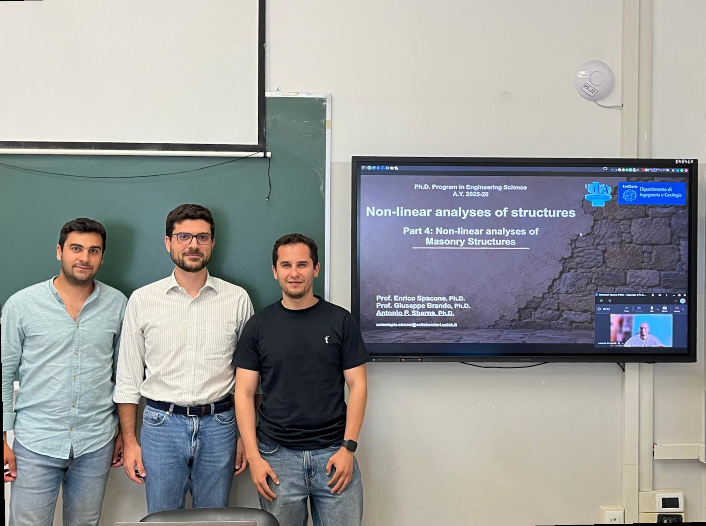

  

## Course description

The course introduces the nonlinear behaviour and numerical modelling of masonry structures, from material heterogeneity and failure mechanisms to constitutive properties and modelling strategies. It covers micro-, macro-, equivalent-frame, and discrete approaches, with a final focus on masonry infills and their interaction with reinforced concrete frames.

## Links

- [Course timetable](https://www.ingeo.unich.it/documenti/__0__uda/__12729__ingeo/__12731__corsi_dottorato/__16535__dottorato_in_engineering_science/Timetable_41_ciclo_v3.pdf)
- [Official short program](https://www.ingeo.unich.it/documenti/__0__uda/__12729__ingeo/__12731__corsi_dottorato/__16535__dottorato_in_engineering_science/Training_activities_PhD_Engineering_Science_C41.pdf)
- [Detailed program](nonlin_masonry_program_2026.pdf)

## Questionario finale

Questionario attivo fino al 9 luglio. Compilazione: circa due minuti.

<iframe width="640px" height="480px" src="https://forms.office.com/Pages/ResponsePage.aspx?id=0Lf4QSGaXEGcaaZ5hPPQ3l3z7C0bnZ9Ep-sTFWHQMOdUNERHRFAyRklTVDI1STBDNkpSV1M3UVJCVC4u&embed=true" frameborder="0" marginwidth="0" marginheight="0" style="border: none; max-width:100%; max-height:100vh" allowfullscreen webkitallowfullscreen mozallowfullscreen msallowfullscreen> </iframe>
